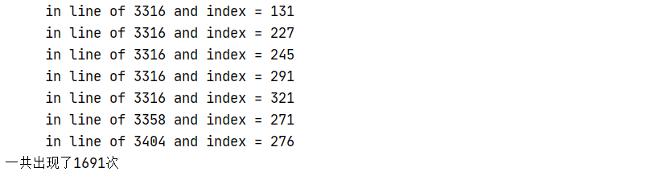

# 全文检索

> 本方法用于检索一个长篇文章中某一个词出现的次数

###### 思路

还记得上学期学到的LZW压缩，这次我全文检索用到的思路于其类似，即先一个字一个字的查找，如果没有在dict中，则添加一个新键值对；如果已经在dict中，先记录这个字的位置，然后截取这个字以及其后一个字形成的字符串，再查看是否在dict中。。。

实际在实现的时候，我们主要想查的是词，所以要限制至少要长度为2以上才能多次记录位置

###### 实现代码

```python
def check():
    file = open(URL, encoding="UTF-8")
    lines = file.readlines()
    num_of_line = 1
    for line in lines:
        length = len(line)
        index = 0
        while index < length - 1:
            p = index + 1
            while line[index:p] in dict and p <= length:
                if line[index] == ' ':
                    break
                if p - index >= 2:
                    word = line[index:p]
                    dict[word] = dict[word] + ';' + 'in line of ' + str(num_of_line) + " and index = " + str(index)
                p = p + 1
            word = line[index:p]
            if word != " ":
                dict[word] = 'in line of ' + str(num_of_line) + " and index = " + str(index)
            index = index + 1
        num_of_line = num_of_line + 1
        
def start():
    check()

    print("total words: ", len(dict))

    # query
    while True:
        print("query: ", end="")
        word = input()
        if word in dict:
            for wh in dict[word].split(";"): # [:20]:  # 仅显示20个位置
                print("\t", wh)
            print("一共出现了" + str(len(dict[word].split(";"))) + "次")
        elif word == 'q':
            print("exit.")
            break
        else:
            print("none hit")
```

###### 效果展示

玄德 出现次数


曹操 出现次数


孔明 出现次数


